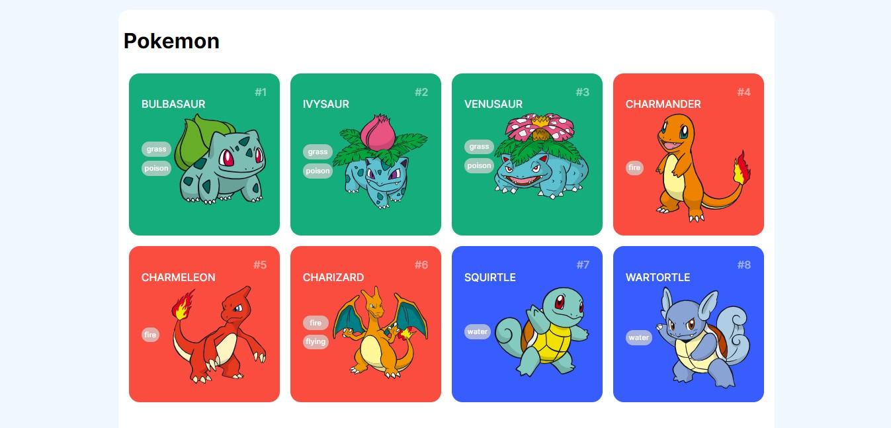

<h1 align="center">Pokedex App</h1>

O projeto foi desenvolvido com o foco no consumo de API, com o objetivo de apresentar uma lista de Pokemons contendo informações como ID, nome, foto e tipos.
 

 

  

## Demo

## 🚀 Tecnologias

Esse projeto foi desenvolvido com as seguintes tecnologias:

- HTML5
- CSS3
- JavaScript

## 💻 Projeto

O projeto foi desenvolvido com o foco no consumo de API, com o objetivo de apresentar uma lista de Pokemons contendo informações como ID, nome, foto e tipos.
- Os dados são extraídos a partir da API: https://pokeapi.co/api/v2/pokemon/
- Site oficial: https://pokeapi.co/docs/v2
